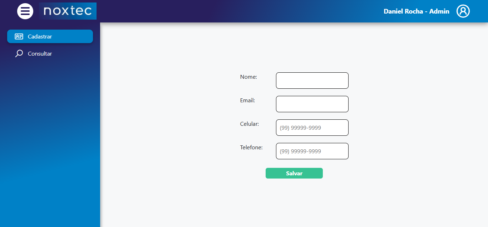
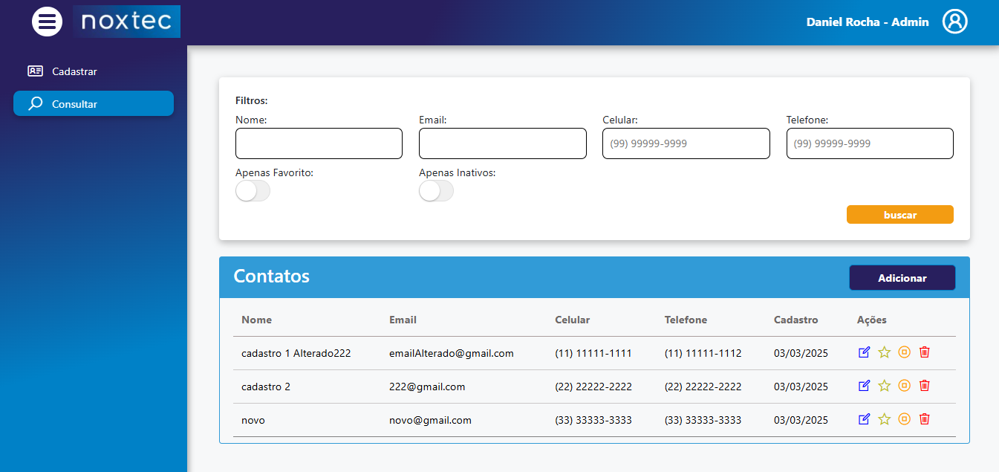
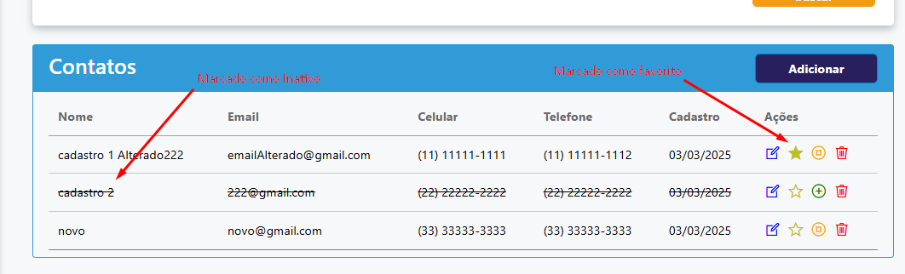
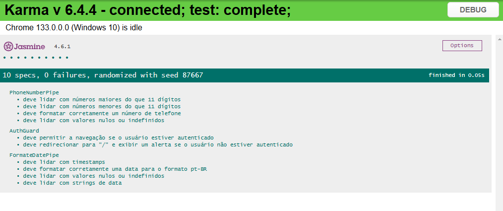

# Sistema de Agendamento Telefônico

## Visão Geral

Este projeto é uma implementação de um sistema de agendamento telefônico desenvolvido em **Angular**. O objetivo principal é permitir o cadastro, consulta, edição e inativação de contatos, além de possibilitar a marcação de contatos favoritos. O projeto foi estruturado de forma organizada, utilizando boas práticas de desenvolvimento e garantindo segurança nas rotas por meio de **Guards**.

<p align="center">
  
</p>

## Tecnologias Utilizadas

- **Angular 19.2.0** (versão mais recente)
- **TypeScript**
- **Bootstrap 5.3.3** (para estilização e responsividade)
- **ngx-ui-switch 15.0.0** (para componente switch - Implementação de contatos Favoritos e Ativos)
- **ngx-mask 19.0.6** (para máscaras)
- **Angular Router** (para navegação entre páginas)
- **Guards** (para proteção de rotas)
- **Angular Testing (Jasmine/Karma)** (para testes unitários)

## Funcionalidades

### 1. Tela de Cadastro de Contatos

- Formulário para cadastrar um novo contato.
- Validação para verificar se o número de celular já foi cadastrado.
- Mensagens de erro e feedback para o usuário.

<p align="center">
  
</p>

### 2. Tela de Consulta de Contatos

- Campo de busca para encontrar contatos rapidamente.
- Exibição da lista de contatos cadastrados.
- Indicação visual para contatos favoritos.

<p align="center">
  
</p>

### 3. Atualização e Inativação de Contatos

- Possibilidade de editar informações de um contato existente.
- Opção para inativar contatos, impedindo sua utilização sem excluí-los permanentemente.
- Filtro para exibir ou ocultar contatos inativos.

### 4. Favoritos

- Opção para marcar/desmarcar um contato como favorito.
- Destaque visual para contatos favoritos.

<p align="center">
  
</p>

## Estrutura do Projeto

O projeto segue uma estrutura modular para facilitar a manutenção e escalabilidade:

```
├── src
│   ├── app
│   │   ├── modules
│   │   │   ├── contacts (módulo de contatos)
│   │   │   ├── login (módulo de autenticação)
│   │   ├── app-route.ts
│   │   ├── app.component.ts
│   |   ├── shared (recursos reutilizáveis)
│   ├── environments (configuração de ambientes)
```

## Proteção de Rotas

- Implementação de **Guards** para restringir acesso a determinadas páginas.
- Utilização de **AuthGuard** para verificar permissões antes da navegação.

## Testes Unitários

Foram implementados testes unitários com **Jasmine e Karma**.

<p align="center">
  
</p>

## Como Executar o Projeto

### 1. Clonar o Repositório

```
git clone https://github.com/DanielSoaresRocha/l2code-test.git
cd telephone-scheduling
```

### 2. Instalar Dependências

```
npm install
```

### 3. Executar o Servidor

```
npm run start
```

A aplicação estará disponível em `http://localhost:4200/`.

### 4. Rodar Testes Unitários

```
npm test
```

## Considerações Finais

Este projeto foi desenvolvido seguindo boas práticas de desenvolvimento, garantindo um código limpo, organizado e seguro. A implementação de testes unitários reforça a confiabilidade do sistema, e a utilização de **Guards** assegura a proteção das rotas.

Para sugestões, melhorias ou colaboração no projeto, fique à vontade para abrir um Pull Request ou entrar em contato.

---

## License 📝

This project is licensed under the [MIT License](https://opensource.org/licenses/MIT) - see the [LICENSE](LICENSE) file for details.

## Autor

<table>
  <tr>
    <td align="center"><a href="https://github.com/DanielSoaresRocha"><br /><sub><b>Daniel Soares</b></sub></a><br /><a href="https://github.com/DanielSoaresRocha/ESIG-challenge/commits?author=DanielSoaresRocha" title="Code">💻</a></td>
  <tr>
</table>
